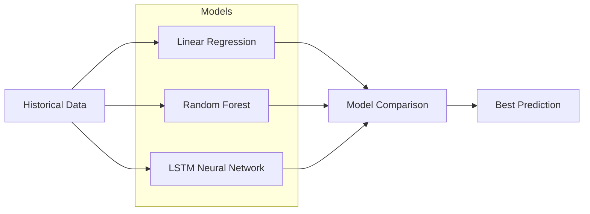

# 📊 Colombo Stock Market Prediction System - Complete Analysis Report

---

## Executive Summary

| Item | Details |
|------|---------|
| **Project** | Stock Market Trend Prediction System |
| **Target** | Colombo Stock Exchange (CSE) |
| **University** | NSBM Green University |
| **Supervisor** | Ms. Nimesha Hewawasama |
| **Timeline** | October 2025 - April 2026 |

---

## Documents Analyzed

| Document | Content |
|----------|---------|
| [COLOMBO STOCK MARKECT PRIDICTIVE SYSYTEM.pdf](file:///d:/nethumi%20final%20research/COLOMBO%20STOCK%20MARKECT%20PRIDICTIVE%20SYSYTEM.pdf) | UI/UX Designs - User & Admin panels |
| [Stock Market Trend Prediction System...PROPOSAL.pdf](file:///d:/nethumi%20final%20research/Stock%20Market%20Trend%20Prediction%20System%20using%20Machine%20Learning%20PROPOSAL%20(1).pdf) | Project Proposal with full requirements |
| [stock new.pdf](file:///d:/nethumi%20final%20research/stock%20new.pdf) | Alternative wireframe designs |
| [explain.txt](file:///d:/nethumi%20final%20research/explain.txt) | Functional & Non-Functional Requirements |
| [Historical Data.zip](file:///d:/nethumi%20final%20research/Historical%20Data.zip) | 10 years of data for 5 companies |

---

## UI/UX Features Required

### 👤 User Panel (7 Pages)
| # | Page | Description |
|---|------|-------------|
| 1 | **Home Dashboard** | Overview with market summary |
| 2 | **Prediction** | 30-day forecast visualization |
| 3 | **Model Comparison** | Compare Linear Regression, Random Forest, LSTM |
| 4 | **News** | Stock-related news feed |
| 5 | **Report** | Downloadable analysis reports |
| 6 | **Heatmap** | Market sector performance heatmap |
| 7 | **Settings** | User preferences |

### 👨‍💼 Admin Panel (5 Pages)
| # | Page | Description |
|---|------|-------------|
| 1 | **Admin Dashboard** | System statistics overview |
| 2 | **User Management** | CRUD for users |
| 3 | **Stock Management** | Add/edit/remove stocks |
| 4 | **ML Model Management** | Manage trained models |
| 5 | **Run Training** | Trigger model retraining |

---

## Technology Stack (From Proposal)

| Category | Technologies |
|----------|-------------|
| **Backend** | Python, Flask/Django |
| **Frontend** | React.js or Vue.js |
| **ML Libraries** | Scikit-learn, TensorFlow/Keras, Pandas, NumPy |
| **Database** | MySQL / PostgreSQL |
| **Visualization** | Plotly, Chart.js, Matplotlib |
| **APIs** | Alpha Vantage API, EODHD API |
| **Deployment** | Render, Heroku, Firebase |

---

## ML Models to Implement



| Model | Purpose | Strengths |
|-------|---------|-----------|
| **Linear Regression** | Simple trend lines | Fast, interpretable |
| **Random Forest** | Feature interactions | Handles non-linearity |
| **LSTM** | Temporal patterns | Best for time-series |

---

## 🚀 Step-by-Step Implementation Guide

### Phase 1: Environment Setup (Week 1)
```bash
# 1. Create project structure
mkdir -p backend frontend/css frontend/js data/raw data/processed models

# 2. Create virtual environment
python -m venv venv
venv\Scripts\activate

# 3. Install dependencies
pip install flask tensorflow pandas numpy scikit-learn matplotlib plotly flask-cors
```

### Phase 2: Data Preparation (Week 2-3)
1. **Merge Data**: Combine 2015-2020 and 2020-2025 CSVs
2. **Clean Data**: Fix missing Open/Close values
3. **Add Features**: Calculate RSI, MACD, Moving Averages
4. **Normalize**: Scale to 0-1 range
5. **Create Sequences**: 60-day windows for LSTM

### Phase 3: Model Development (Week 4-7)
1. **Linear Regression**: Train baseline model
2. **Random Forest**: Train with feature importance
3. **LSTM**: Build 2-layer network (128 + 64 units)
4. **Compare Models**: Calculate RMSE, MAE, R²
5. **Save Models**: Export as `.h5` or `.pkl` files

### Phase 4: Backend API (Week 8-9)
Build these endpoints:
| Endpoint | Method | Description |
|----------|--------|-------------|
| `/api/companies` | GET | List all companies |
| `/api/predict/{company}` | GET | Get 30-day prediction |
| `/api/compare-models` | GET | Compare model metrics |
| `/api/heatmap` | GET | Sector performance data |
| `/api/news` | GET | Latest stock news |
| `/admin/train` | POST | Trigger retraining |

### Phase 5: Frontend UI (Week 10-12)
1. **Setup React**: `npx create-react-app frontend`
2. **Build Components**:
   - `CompanySelector.jsx`
   - `PredictionChart.jsx`
   - `ModelComparison.jsx`
   - `Heatmap.jsx`
   - `NewsPanel.jsx`
3. **Style with CSS**: Modern, responsive design
4. **Connect to API**: Use axios/fetch

### Phase 6: Testing & Deployment (Week 13-14)
1. Test model accuracy (RMSE < 5%)
2. Test all API endpoints
3. Test UI responsiveness
4. Deploy to Heroku/Render

---

## ⚠️ Issues Found

> [!WARNING]
> **Data Quality Issues**
> 1. Missing Open/Close values on several dates
> 2. JKH price scale changed drastically (Rs.200+ → Rs.20+) around Nov 2024
> 3. Duplicate entries in some CSV files
> 4. Inconsistent date formats

> [!CAUTION]
> **Project Risks**
> 1. Alpha Vantage API has rate limits (5 calls/min free tier)
> 2. EODHD API costs 3,000 LKR - confirm budget
> 3. Timeline is tight (Oct 2025 - Apr 2026)

---

## ✅ What to Do Next

1. **Confirm Tech Stack** - Flask or Django? React or Vue?
2. **Set Up API Keys** - Register for Alpha Vantage & EODHD
3. **Fix Data Issues** - Clean the historical CSVs before training
4. **Start with Simple Model** - Get Linear Regression working first
5. **Build UI Iteratively** - Start with Home Dashboard, then add features

---

## Timeline Summary

| Phase | Duration | Deadline |
|-------|----------|----------|
| Data Collection | 1 week | Nov 2025 |
| Data Preprocessing | 3 weeks | Nov 2025 |
| Model Development | 4 weeks | Dec 2025 |
| Web Dashboard | 4 weeks | Jan 2026 |
| Visualization | 3 weeks | Feb 2026 |
| Testing | 3 weeks | Mar 2026 |
| Final Report | 2 weeks | Apr 2026 |

---

## Questions to Clarify

1. **Authentication**: How will users log in? (JWT, Session-based, OAuth?)
2. **Data Source Priority**: Use local CSVs or live API data?
3. **Report Export**: What format? (PDF, Excel, both?)
4. **Deployment Platform**: Heroku (free tier ending) or Render?
5. **Mobile Support**: Responsive web only or mobile app needed?
