# Colombo Stock Market Prediction System - Complete Implementation Guide

A comprehensive guide to build a stock price prediction system for the Colombo Stock Exchange using LSTM deep learning.

---

## Project Overview

| Aspect | Details |
|--------|---------|
| **Target Market** | Colombo Stock Exchange (CSE) |
| **Companies** | 5 major companies (JKH, COMB, CTC, DIAL, DIST) |
| **Data Range** | 2015-2025 (10 years) |
| **ML Model** | LSTM (Long Short-Term Memory) |
| **Prediction** | 30-day forecast |

---

## User Review Required

> [!IMPORTANT]
> **Technology Stack Decisions Required**
> Please confirm your preferred technologies:
> 1. **Backend**: Python Flask vs FastAPI vs Django?
> 2. **Frontend**: React vs Vue.js vs plain HTML/CSS/JS?
> 3. **Database**: PostgreSQL vs MongoDB vs SQLite (for demo)?
> 4. **Deployment**: Local only vs Cloud (AWS/Azure/Heroku)?

> [!WARNING]
> **Data Considerations**
> - The historical data has some gaps (empty Open/Close values on certain dates)
> - Data needs significant preprocessing before model training
> - Stock prices changed format around Nov 2024 (went from Rs.20-25 to Rs.200+ range for JKH - possible stock split adjustment needed)

---

## System Architecture

```mermaid
flowchart TB
    subgraph Frontend["🖥️ Frontend Layer"]
        UI[Web Interface]
        Charts[Interactive Charts]
        Metrics[Metrics Display]
    end
    
    subgraph Backend["⚙️ Backend Layer"]
        API[REST API]
        Auth[Authentication]
        ML[ML Service]
    end
    
    subgraph Data["💾 Data Layer"]
        DB[(Database)]
        Model[Trained LSTM Model]
        CSV[Historical CSV Data]
    end
    
    UI --> API
    Charts --> API
    Metrics --> API
    API --> Auth
    API --> ML
    ML --> Model
    API --> DB
    CSV --> DB
```



---

## Proposed Implementation

### Phase 1: Environment Setup

#### [NEW] [requirements.txt](file:///d:/nethumi%20final%20research/requirements.txt)
```
tensorflow>=2.10.0
pandas>=1.5.0
numpy>=1.23.0
scikit-learn>=1.1.0
matplotlib>=3.6.0
flask>=2.2.0
flask-cors>=3.0.0
```

#### [NEW] [.env.example](file:///d:/nethumi%20final%20research/.env.example)
```
FLASK_ENV=development
SECRET_KEY=your_secret_key
DATABASE_URL=sqlite:///stock_data.db
```

---

### Phase 2: Data Preprocessing Pipeline

#### [NEW] [backend/data_processor.py](file:///d:/nethumi%20final%20research/backend/data_processor.py)

**Key tasks:**
1. **Load & Merge Data** - Combine 2015-2020 and 2020-2025 datasets
2. **Handle Missing Values** - Fill gaps in Open/Close prices
3. **Normalize Data** - Scale prices using MinMaxScaler (0-1 range)
4. **Create Sequences** - Generate 60-day sequences for LSTM input
5. **Train/Test Split** - 80% training, 20% testing

**Data Issues to Fix:**
- Empty Open values (e.g., line 8: `,,21.7,,21.3`)
- Price scale inconsistency (Oct 2024: Rs.200+ vs Nov 2024: Rs.20+)
- Duplicate entries (e.g., lines 48-49, 332-333)

---

### Phase 3: LSTM Model Development

#### [NEW] [backend/model.py](file:///d:/nethumi%20final%20research/backend/model.py)

**Model Architecture:**
```
┌─────────────────────────────────────┐
│         Input Layer (60, 5)        │
│   [Open, High, Low, Close, Volume] │
├─────────────────────────────────────┤
│     LSTM Layer 1 (128 units)       │
│     dropout: 0.2                   │
├─────────────────────────────────────┤
│     LSTM Layer 2 (64 units)        │
│     dropout: 0.2                   │
├─────────────────────────────────────┤
│     Dense Layer (25 units)         │
├─────────────────────────────────────┤
│     Output Layer (1 unit)          │
│     [Predicted Close Price]        │
└─────────────────────────────────────┘
```

**Training Parameters:**
- Epochs: 100
- Batch Size: 32
- Optimizer: Adam
- Loss: Mean Squared Error
- Early Stopping: patience=10

---

### Phase 4: Backend API Development

#### [NEW] [backend/app.py](file:///d:/nethumi%20final%20research/backend/app.py)

**API Endpoints:**

| Method | Endpoint | Description |
|--------|----------|-------------|
| GET | `/api/companies` | List all 5 companies |
| GET | `/api/companies/{id}/historical` | Get historical data |
| GET | `/api/companies/{id}/prediction` | Get 30-day forecast |
| GET | `/api/companies/{id}/metrics` | Get model metrics (RMSE, MAE) |
| POST | `/api/admin/upload` | Upload new CSV data |
| POST | `/api/admin/retrain` | Trigger model retraining |

---

### Phase 5: Frontend Development

#### [NEW] [frontend/index.html](file:///d:/nethumi%20final%20research/frontend/index.html)

**UI Components:**

```mermaid
flowchart TD
    subgraph Header
        Logo[📈 CSE Predictor]
        Nav[Navigation]
    end
    
    subgraph Main
        Dropdown[Company Selector]
        Chart1[Actual vs Predicted Chart]
        Chart2[30-Day Forecast Chart]
        MetricsPanel[Model Metrics Panel]
    end
    
    subgraph Footer
        News[Stock News Feed]
        Credits[Credits]
    end
    
    Header --> Main --> Footer
```



**Key Features:**
1. **Company Dropdown** - Select from 5 companies
2. **Interactive Charts** - Using Chart.js or Plotly.js
3. **Real-time Updates** - Charts update on company selection
4. **Metrics Display** - RMSE, MAE prominently shown
5. **Responsive Design** - Mobile & Desktop compatible

---

## Directory Structure

```
d:\nethumi final research\
├── backend/
│   ├── app.py              # Flask application
│   ├── model.py            # LSTM model definition
│   ├── data_processor.py   # Data preprocessing
│   ├── train.py            # Model training script
│   └── models/             # Saved model weights
│       ├── JKH_model.h5
│       ├── COMB_model.h5
│       └── ...
├── frontend/
│   ├── index.html
│   ├── css/
│   │   └── styles.css
│   └── js/
│       ├── app.js
│       └── charts.js
├── data/
│   ├── raw/                # Original CSV files
│   └── processed/          # Cleaned & merged data
├── requirements.txt
├── .env.example
└── README.md
```

---

## Verification Plan

### Automated Tests

| Test Type | Command | Description |
|-----------|---------|-------------|
| Data Validation | `python -m pytest tests/test_data.py` | Verify data loading & cleaning |
| Model Unit Tests | `python -m pytest tests/test_model.py` | Test model architecture |
| API Tests | `python -m pytest tests/test_api.py` | Test all API endpoints |

### Manual Verification

1. **Data Integrity Check**
   - Open processed CSV, verify no missing values
   - Verify date range covers 2015-2025

2. **Model Accuracy Check**
   - Train model, observe loss curves
   - Verify RMSE < 5% of average stock price

3. **UI Testing**
   - Load frontend in browser
   - Select each company, verify charts update
   - Test on mobile viewport

4. **Performance Testing**
   - Charts should load < 2 seconds after company selection (per NFR)

---

## Implementation Timeline


---

## Suggested Changes & Improvements

> [!TIP]
> **Recommendations to enhance the project:**

1. **Add Technical Indicators** - Include RSI, MACD, Bollinger Bands as additional features
2. **Ensemble Models** - Combine LSTM with GRU or Random Forest for better predictions
3. **Real-time Data Feed** - Integrate CSE API for live data updates
4. **User Authentication** - Add JWT-based login for admin features
5. **Caching Layer** - Use Redis to cache predictions for faster responses
6. **Docker Deployment** - Containerize for easy deployment

---

## Quick Start Commands

```bash
# 1. Create virtual environment
python -m venv venv
venv\Scripts\activate  # Windows

# 2. Install dependencies
pip install -r requirements.txt

# 3. Process data
python backend/data_processor.py

# 4. Train models
python backend/train.py

# 5. Start backend server
python backend/app.py

# 6. Open frontend
# Open frontend/index.html in browser
```

---

## Questions for You

1. **Authentication Required?** - Should users need to log in, or is this a public dashboard?
2. **Historical Data View** - Table format or chart only?
3. **Admin Features** - Do you need CSV upload & model retraining from the UI?
4. **News Integration** - Should we include stock news API integration?
5. **Mobile App** - Is a responsive web app sufficient, or do you need a mobile app?
